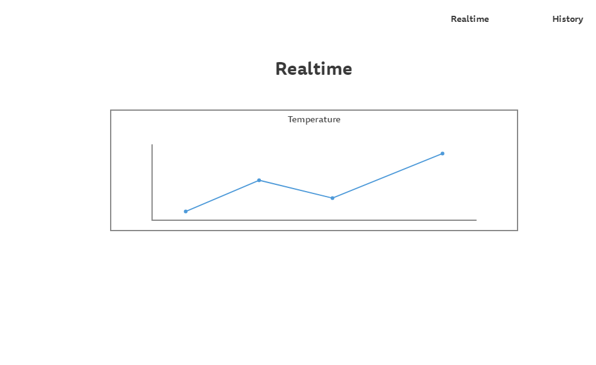
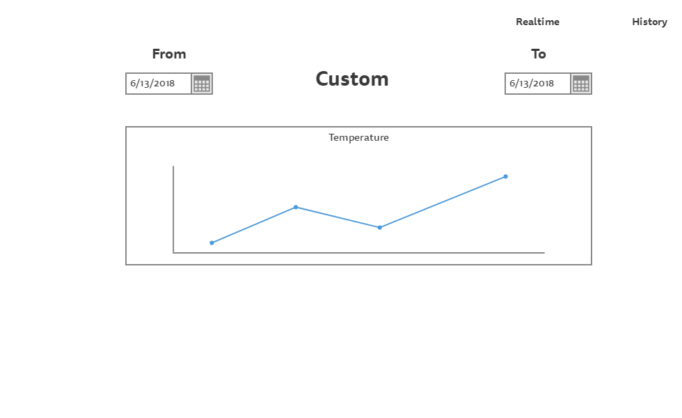

# Техническое задание "ArduinoTemp"

## Оглавление
* [Введение](#ВВЕДЕНИЕ)
  * [Назначение](#НАЗНАЧЕНИЕ)
  * [Целевая аудитория](#ЦЕЛЕВАЯ-АУДИТОРИЯ)
* [Общее описание](#ОБЩЕЕ-ОПИСАНИЕ)
  * [Описание](#ОПИСАНИЕ)
  * [Общая Функциональность](#ОБЩАЯ-ФУНКЦИОНАЛЬНОСТЬ)
    * [С точки зрения разработчиков](#С-ТОЧКИ-ЗРЕНИЯ-РАЗРАБОТЧИКОВ)
    * [С точки зрения клиента](#С-ТОЧКИ-ЗРЕНИЯ-КЛИЕНТА)
  * [Функции продукта](#ФУНКЦИИ-ПРОДУКТА)
    * [Бэкенд (плата)](#БЭКЕНД-ПЛАТА)
    * [Фронтенд (сайт)](#ФРОНТЕНД-САЙТ)
    * [Бэкенд (сервер)](#БЭКЕНД-СЕРВЕР)
  * [Характеристики пользователя](#ХАРАКТЕРИСТИКИ-ПОЛЬЗОВАТЕЛЯ)
  * [Ограничения](#ОГРАНИЧЕНИЯ)
* [Детальные требования](#ДЕТАЛЬНЫЕ-ТРЕБОВАНИЯ)
  * [Плата](#ПЛАТА)
    * [Макет](#МАКЕТ)
    * [Функциональные требования](#ФУНКЦИОНАЛЬНЫЕ-ТРЕБОВАНИЯ)
    * [Стек технологий](#СТЕК-ТЕХНОЛОГИЙ)
  * [Сервер](#СЕРВЕР)
    * [Интерфейс пользователя](#ИНТЕРФЕЙС-ПОЛЬЗОВАТЕЛЯ-САЙТ)
    * [Серверный интерфейс (API)](#СЕРВЕРНЫЙ-ИНТЕРФЕЙС-api)
    * [Функциональные требования](#ФУНКЦИОНАЛЬНЫЕ-ТРЕБОВАНИЯ)
    * [Описание возможностей](#ОПИСАНИЕ-ВОЗМОЖНОСТЕЙ)
    * [Системные требования](#СИСТЕМНЫЕ-ТРЕБОВАНИЯ)
    * [Стек технологий](#СТЕК-ТЕХНОЛОГИЙ)

## ВВЕДЕНИЕ
### НАЗНАЧЕНИЕ
Создание системы для измерения температуры и отслеживания ее в реальном времени с помощью веб интерфейса.

### ЦЕЛЕВАЯ АУДИТОРИЯ
Пользователи данного устройства.

## ОБЩЕЕ ОПИСАНИЕ
### ОПИСАНИЕ
Данная система прдставляет собой устройство для измерения температуры и отправки её на сервер, а также веб интерфейса для отслеживания значений температуры в реальном времени. 

### ОБЩАЯ ФУНКЦИОНАЛЬНОСТЬ
#### С ТОЧКИ ЗРЕНИЯ РАЗРАБОТЧИКОВ
* Создать плату для измерения температуры и отправки полученных данных на сервер;
* Создать сервер с базой данных для хранения значений температуры;
* Создать веб интерфейс для отображения графика температуры в реальном времени.
#### С ТОЧКИ ЗРЕНИЯ КЛИЕНТА
* Предоставить возможность отслеживания температуры;
* Получение информативных графиков в режиме реального времени

### ФУНКЦИИ ПРОДУКТА
#### БЭКЕНД (ПЛАТА)
* Считывание темпертуры;
* Передача данных температуры.
#### ФРОНТЕНД (САЙТ)
* Просмотр графика температуры в реальном времени;
* Просмотр графика температуры за определенный период.
#### БЭКЕНД (СЕРВЕР)
* Хранение всех значений температуры.

### ХАРАКТЕРИСТИКИ ПОЛЬЗОВАТЕЛЯ
* Владелец данного устройства для измерения темературы;
* Пользователь, имеющий доступ к сети Интернет.

### ОГРАНИЧЕНИЯ
* Устройство для измерения темпереатуры должно быть создано по имеющейся схеме.

## ДЕТАЛЬНЫЕ ТРЕБОВАНИЯ  
### ПЛАТА  
#### МАКЕТ
.png)  
#### КОМПЛЕКТАЦИЯ УСТРОЙСТВА    
* Arduino Uno;  
* Датчик температуры TMP36;
* Микроконтроллер ESP8266.  
#### СТЕК ТЕХНОЛОГИЙ
* Processing.

### СЕРВЕР
#### ИНТЕРФЕЙС ПОЛЬЗОВАТЕЛЯ (САЙТ)
[Макет сайта](https://gomockingbird.com/projects/ghpz87a/TnMd3U)  
Интерфейс пользователя представляет собой сайт, который включает в себя следующие страницы:
1. **Страница Realtime**  
Отображение температуры на данный момент.

2. **Страница History**  
Отображение графика изменения температур за указанный промежуток времени.

#### СЕРВЕРНЫЙ ИНТЕРФЕЙС (API)  
Метод для внесения значений температуры в базу данных.
#### ФУНКЦИОНАЛЬНЫЕ ТРЕБОВАНИЯ  
* Отображение и обновление графика температуры в реальном времени;  
* Выбор промежутка и отображение соответствуюшего графика температуры.   
#### ОПИСАНИЕ ВОЗМОЖНОСТЕЙ
* Просмотр графиков.
#### СИСТЕМНЫЕ ТРЕБОВАНИЯ
* ОС: Windows, Linux, MacOS X
* CPU: 1.2Gz
* RAM: 1 Gb
* Storage: Минимум 1 Gb
#### СТЕК ТЕХНОЛОГИЙ
* Python Flask.
